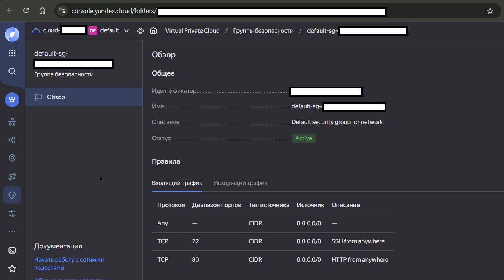
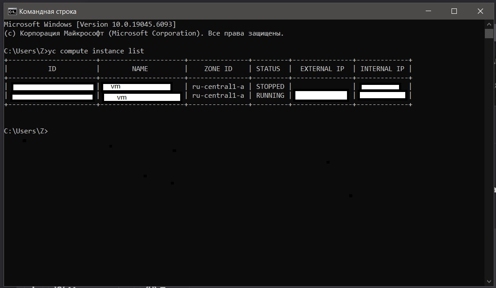
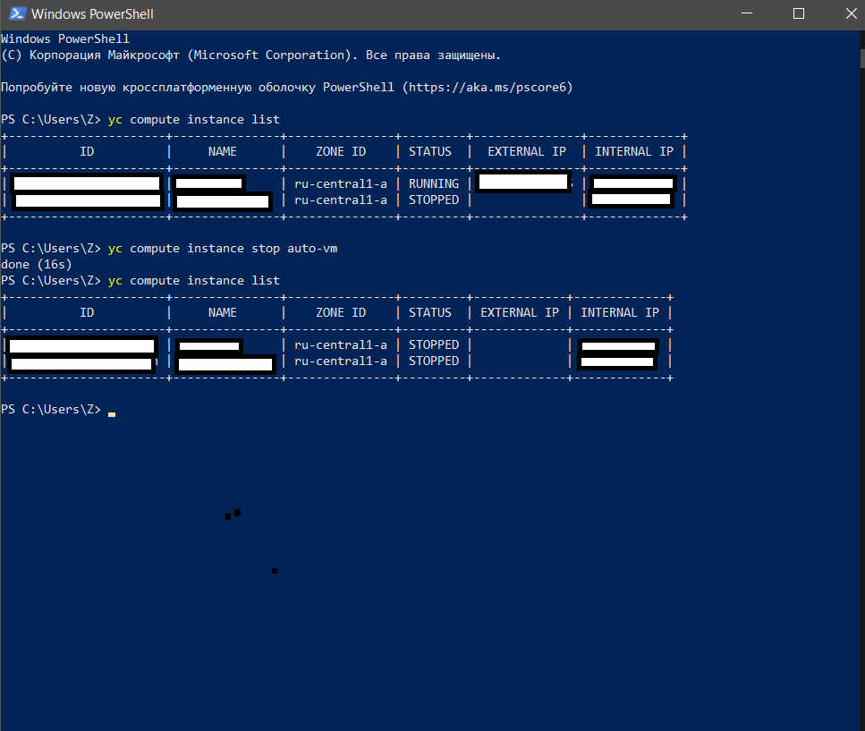
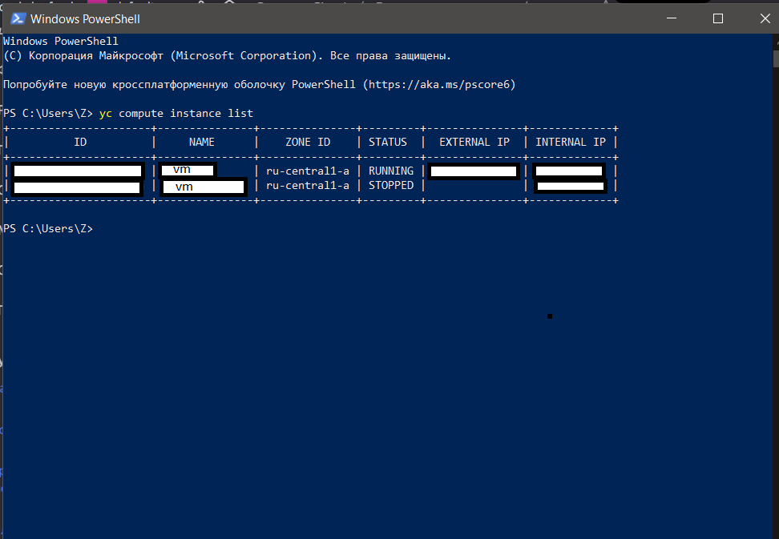
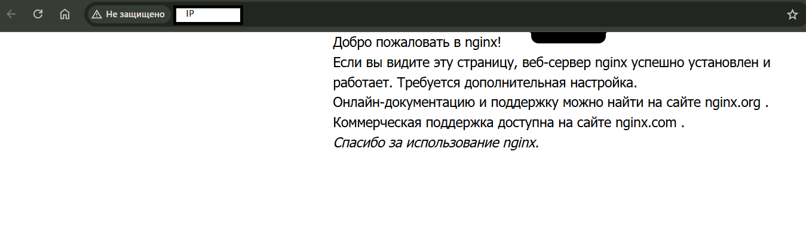
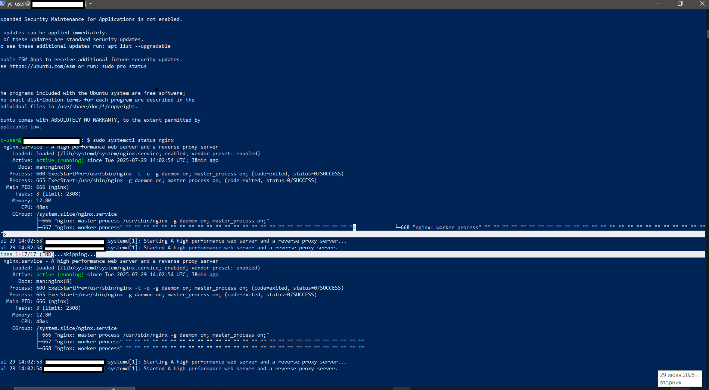
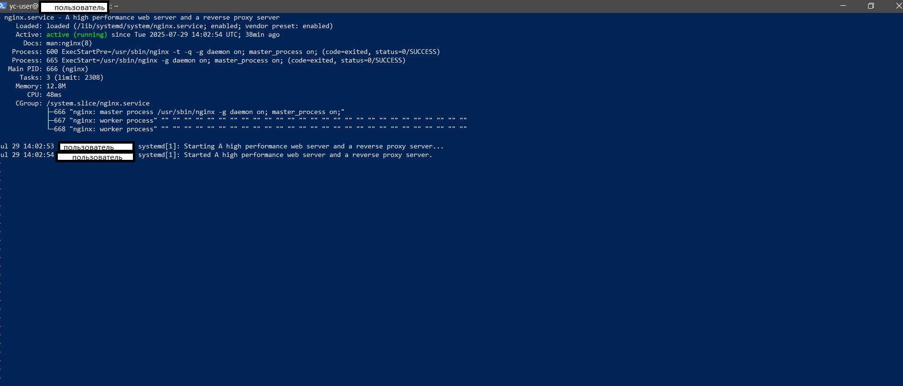
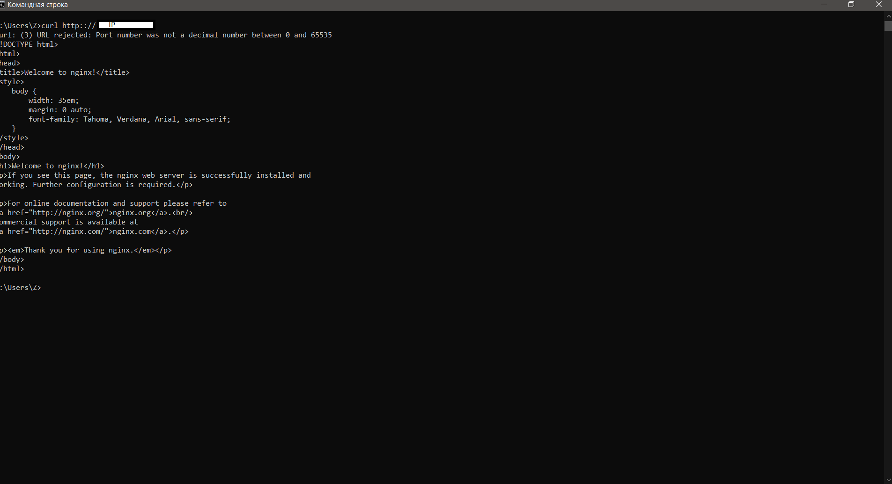
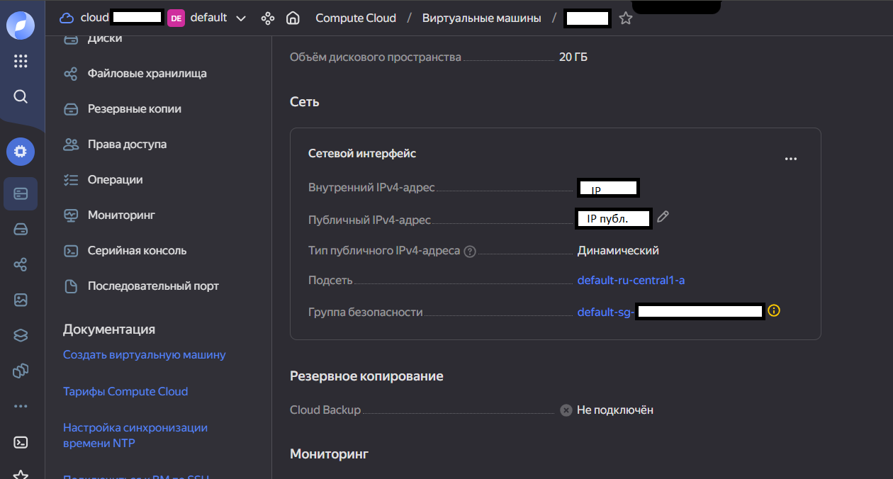

# Мой DevOps Journey

Привет, я Катя,  
Это мой учебный проект по автоматизации создания виртуальной машины в [Yandex Cloud](https://cloud.yandex.ru) с помощью Python.

Этот репозиторий — часть моего пути от новичка к DevOps.  
Здесь я делюсь реальными ошибками, решениями и пошаговым руководством.

---

[](https://www.python.org/)
[]
[](https://creativecommons.org/licenses/by/4.0/)

---

## Что внутри

- [`7 ошибок и как я их решила`](./TROUBLESHOOTING.md)
- [`шпаргалка по командам YC CLI`](./YC_CLI_CHEATSHEET.md)
- [`10 скриншотов рабочего процесса`](./images/)
- [requirements.txt](./requirements.txt) — зависимости (см. ниже)
- [LICENSE](./LICENSE) — лицензия

---

## Быстрый старт

1. Установите [YC CLI](https://cloud.yandex.ru/docs/cli/quickstart)
2. **Проверьте Python 3.8+** (проверьте через `python3 --version`)
3. **Установите зависимости:**
   ```bash
   pip install -r requirements.txt
   ```
   (Для работы скрипта нужны только стандартные библиотеки Python, но если появятся дополнительные зависимости — добавляйте их сюда.)
4. **Создайте SSH-ключ, если его ещё нет:**
   ```bash
   ssh-keygen -t ed25519 -C "yc-user"
   ```
   > **Если возникает ошибка "Saving key failed":**  
   > На Windows создайте папку для ключей:  
   > `mkdir "%USERPROFILE%\.ssh"`
5. Запустите скрипт:
   ```bash
   python3 create_vm.py
   ```
6. Откройте `http://<IP>` — увидите страницу Nginx

---

## Полезные команды для управления Yandex Cloud

```bash
# Список ВМ
yc compute instance list

# Создать ВМ вручную (пример)
yc compute instance create \
  --name auto-vm \
  --zone ru-central1-a \
  --public-ip \
  --create-boot-disk image-family=ubuntu-2204-lts,size=20 \
  --memory 2GB \
  --cores 2

# Остановить ВМ
yc compute instance stop auto-vm

# Удалить ВМ
yc compute instance delete auto-vm

# Создать SSH-ключ (если нет)
ssh-keygen -t ed25519 -C "yc-user"
cat ~/.ssh/id_ed25519.pub

# Открыть порт 80 через security group
yc vpc security-group update default --add-rule port=80
```

> Совет: используйте `--format yaml` или `--format json` для детального вывода.

---

## Распространённые ошибки и решения

| Ошибка | Причина | Решение |
|--------|--------|--------|
| `Saving key failed` | Нет папки `.ssh` | `mkdir "%USERPROFILE%\.ssh"` |
| `SSH key not found` | Ключ не найден | `ssh-keygen -t ed25519 -C "yc-user"` |
| `Image not found` | Неправильное имя образа | Используйте `ubuntu-2204-lts` |
| `ERROR: unable to read file 'ssh-rsa...'` | Передан ключ как строка | Используйте `#cloud-config` |
| `Connection refused` | ВМ не загружена | Подождите 90 секунд |
| `Zone not available` | Нет ресурсов | Попробуйте `ru-central1-b` (см. примечание ниже) |
| `Port 80 closed` | Группа безопасности | `yc vpc sg update default --add-rule port=80` |

> Мой скрипт решает большинство этих проблем автоматически.

---

### Важно: особенности инфраструктуры

- **Зона:**  
  Если скрипт выдаёт ошибку "Zone not available", попробуйте изменить зону вручную, например, на `ru-central1-b` или `ru-central1-c`.  
  В текущей версии скрипт не меняет зону автоматически, это стоит сделать вручную в переменных окружения или коде.

- **Группа безопасности:**  
  Скрипт открывает порт 80 в группе безопасности с именем `default`. Если такой группы нет или у вас несколько security group, укажите нужную вручную.  
  Подробнее см. [Документацию](https://cloud.yandex.ru/docs/vpc/operations/security-group-update).

- **ufw:**  
  В cloud-init добавлена команда `ufw allow 'Nginx Full'`, однако на свежих Ubuntu образах UFW может быть не установлен или не активирован по умолчанию.  
  Это не мешает работе скрипта (открытие порта осуществляется через security group), но если вы запускаете firewall, убедитесь, что UFW установлен и активирован.

---

## Полный цикл: от инфраструктуры до проверки

### 1. Настройка инфраструктуры

#### Группа безопасности


Правила для портов 22 (SSH) и 80 (HTTP).

#### Список ВМ в консоли


ВМ `test-vm` создана и в статусе `RUNNING`.

---

### 2. Управление через CLI

#### Список ВМ через CLI


Команда: `yc compute instance list`

#### Остановка ВМ


Команда: `yc compute instance stop auto-vm`

#### Проверка статуса


Сравнение работающих и остановленных машин.

---

### 3. Установка и настройка Nginx

#### Страница Nginx в браузере


Стандартная страница после установки.

#### Статус службы Nginx


Служба активна: `active (running)`.

#### Детальный статус процессов


Процессы: `master` и `worker`.

---

### 4. Проверка работоспособности

#### Проверка через curl


Ответ: `HTTP/1.1 200 OK`.

#### Сетевые настройки ВМ


Публичный и внутренний IP, группа безопасности, мониторинг.

---

## Лицензия

Весь текст, включая этот README, распространяется по лицензии [Creative Commons BY 4.0](https://creativecommons.org/licenses/by/4.0/).  
Код скрипта может использоваться по MIT-лицензии (см. LICENSE).  
Вы можете свободно использовать, изменять и распространять этот проект с сохранением указания авторства.

---

#### Честное и важное примечание

Этот проект — часть моего обучения.  
Я написала первую версию скрипта сама, но консультировалась с AI-ассистентом, чтобы:
- Понять, как обрабатывать ошибки
- Сделать код кроссплатформенным
- Научиться писать чистый код

Каждая строка была проверена, протестирована и понята мной.

---

## Планы по улучшению

### Ближайшие улучшения (можно реализовать быстро):

1. **Автоматический перебор зон при ошибке доступности**  
   ```python
   zones_to_try = ["ru-central1-a", "ru-central1-b", "ru-central1-c"]
   for zone in zones_to_try:
       config["zone"] = zone
       # Повторить попытку создания ВМ
   ```
   *Решает проблему "Zone not available" без ручного вмешательства*

2. **Базовое логирование операций**  
   ```python
   import logging
   logging.basicConfig(filename='vm_creator.log', level=logging.INFO)
   ```
   *Для отладки и анализа проблем*

3. **Проверка доступности ВМ по SSH перед продолжением**  
   ```python
   while not is_port_open(ip, 22):
       time.sleep(10)
   ```
   *Исключает проблемы с premature-подключениями*

### Среднесрочные улучшения:

4. **Проверка существования ВМ перед созданием**  
   ```bash
   yc compute instance get <vm_name>
   ```
   *Предотвратит дублирование машин*

5. **Расширенная обработка cloud-init ошибок**  
   *Мониторинг выполнения cloud-init через journalctl*

### Долгосрочные планы:

6. **Интеграция с Terraform для управления инфраструктурой**  
7. **CI/CD пайплайн с GitHub Actions**  
8. **Поддержка мультиклауд-развёртывания (AWS/Azure)**  

---

> 💡 *Хотите помочь с реализацией? Форкайте репозиторий или пишите в Issues!*
```

## Ознакомление с условиями

Я ознакомилась с [условиями контент-программы](https://cloud.yandex.ru/community) и подтверждаю:
- Материал написан мной самостоятельно
- Я согласна с [лицензией Creative Commons](https://creativecommons.org/licenses/by/4.0/)
- Я ознакомилась с [Лицензионным соглашением Яндекса с контрибьютором](https://github.com/yandex-cloud/docs/blob/master/CONTRIBUTING.md)
- Идентификатор моего платёжного аккаунта: `dn2odjekq8o9ihh7hbhv`

---

> Понравился гайд?  
> Оставьте комментарий в [сообществе Яндекс.Облака](https://cloud.yandex.ru/community)!