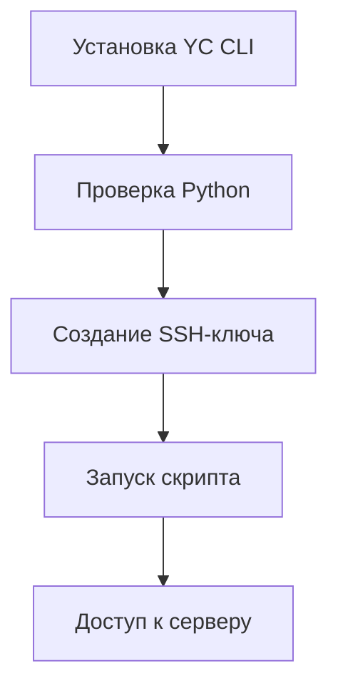

# 🚀 DevOps Journey

- [](.github/SECURITY.md)
- [](https://www.python.org/)
- [](https://cloud.yandex.ru/)
- [](https://creativecommons.org/licenses/by/4.0/)

Проект для изучения DevOps практик на Yandex Cloud. Автоматизированное создание виртуальных машин, настройка инфраструктуры и деплой приложений.




## 🚀 Быстрый старт

> **Прежде чем начать:**  
> Убедитесь, что у вас есть аккаунт в [Yandex Cloud](https://cloud.yandex.ru/)


1. **📥 Устанавливаем Yandex Cloud CLI**  
   ```bash
   curl -sSL https://storage.yandexcloud.net/yandexcloud-yc/install.sh | bash
   exec $SHELL
   yc init
   ```

2. **🐍 Проверяем Python 3.8+**  
   ```bash
   python3 --version
   # Если не установлен: https://www.python.org/downloads/
   ```

3. **🔑 Создаём SSH-ключ**  
   ```bash
   mkdir -p ~/.ssh
   ssh-keygen -t ed25519 -C "yc-user" -f ~/.ssh/id_ed25519
   ```

4. **🚀 Запускаем скрипт**  
   ```bash
   python3 create_vm.py
   ```

5. **🌐 Проверяем результат**  
   Откройте в браузере:  
   `http://<public-IP-адрес>`  
   Должна появиться страница Nginx 🎉

---

### ✅ Чеклист выполнения
- [ ] Установлен YC CLI
- [ ] Проверена версия Python
- [ ] Создан SSH-ключ
- [ ] Запущен скрипт
- [ ] Проверена работа сайта

---

### 🛠️ Если возникли проблемы

| Ошибка                  | Решение                              |
|-------------------------|--------------------------------------|
| `Saving key failed`     | `mkdir "%USERPROFILE%\.ssh"` (Windows) |
| `yc: command not found` | Выполните `source ~/.bashrc`         |
| `ModuleNotFoundError`   | `pip install -r requirements.txt`    |
| `Permission denied`     | `chmod 600 ~/.ssh/id_ed25519`        |

> ℹ️ **Для Windows пользователей:**  
> Используйте [Git Bash](https://gitforwindows.org/) вместо стандартного терминала

---

## 📂 Что внутри

### 🏗️ Инфраструктура
```bash
infra/
├── terraform/       # Конфигурации Terraform
├── network/         # Настройки сети и безопасности
└── autoscaling/     # Примеры автомасштабирования
```

### 🐳 Контейнеризация
```bash
docker/
├── app/             # Dockerfile для приложений
├── nginx/           # Конфигурации веб-сервера
└── best-practices.md # Советы по оптимизации образов
```

### ⚙️ Автоматизация
```bash
automation/
├── create_vm.py     # Скрипт создания ВМ
├── deploy.sh        # Скрипт деплоя
└── monitoring/      # Настройки мониторинга
```

### 🔄 CI/CD
```bash
ci-cd/
├── github-actions/  # Workflow для GitHub Actions
├── jenkins/         # Конфигурации Jenkins
└── gitlab-ci/       # Примеры для GitLab CI
```

---

## 🤝 Как внести вклад
1. Форкните репозиторий
2. Создайте ветку: `git checkout -b feature/your-feature`
3. Сделайте коммит: `git commit -am 'Add some feature'`
4. Запушьте изменения: `git push origin feature/your-feature`
5. Создайте Pull Request

---

## 📜 Лицензия
Этот проект распространяется под лицензией [CC BY 4.0](https://creativecommons.org/licenses/by/4.0/).  
Вы можете свободно использовать, изменять и распространять материалы с указанием авторства.

---
  


